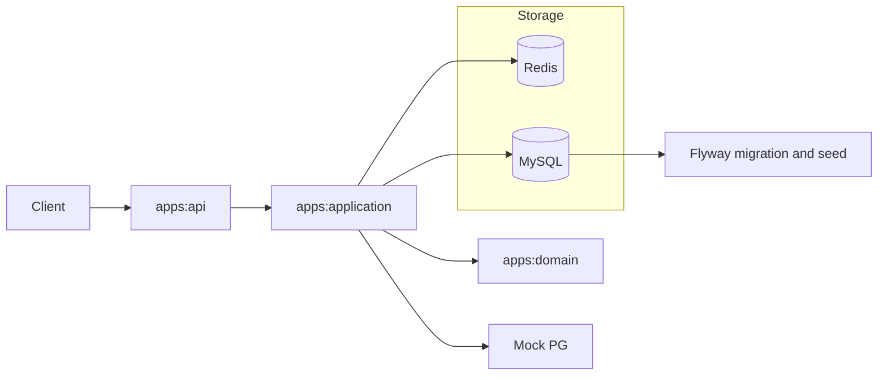
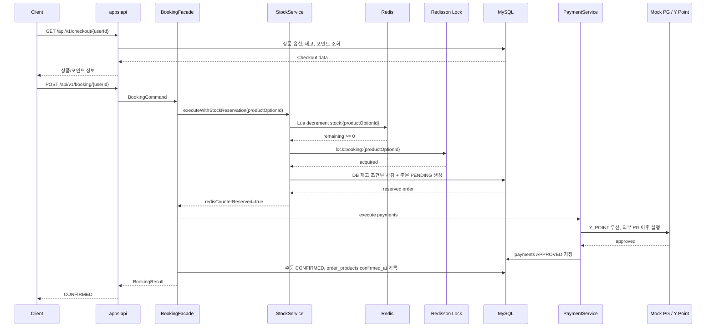
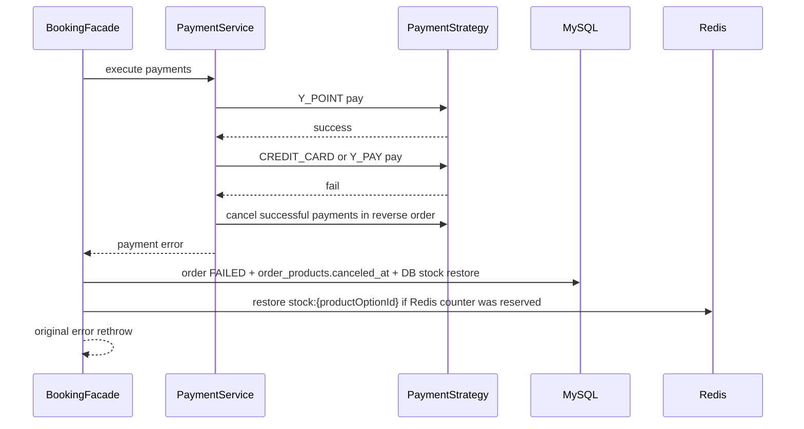
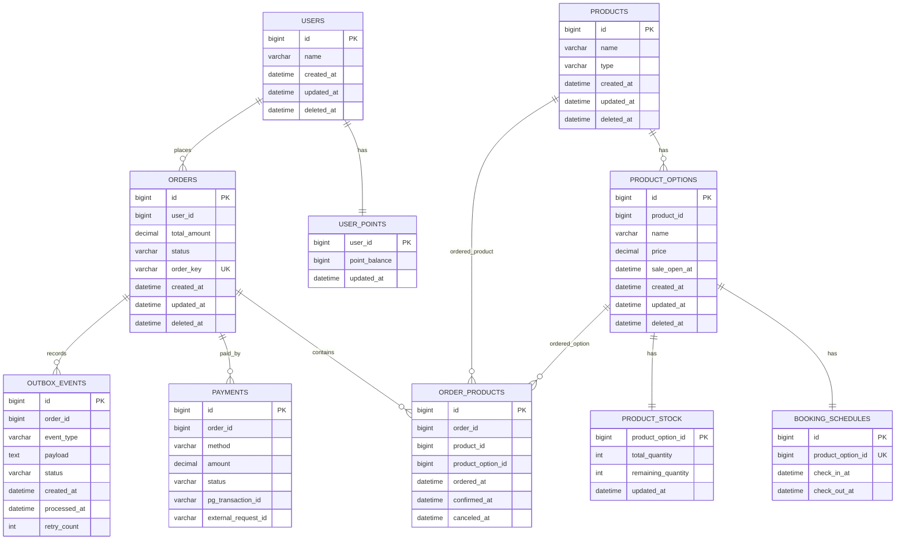

# FCFS Reservation

한정 수량 숙소 상품을 대상으로 00시 오픈 직후의 예약과 결제를 처리하는 Kotlin/Spring Boot 기반 선착순 예약 결제 시스템입니다.

핵심 목표는 재고 10개에 평시 50 TPS, 피크 500~1000 TPS가 들어오는 상황에서도 오버셀링을 막고, 결제 실패나 Redis 장애 상황에서 주문/결제/재고 정합성을 유지하는 것입니다.

## 핵심 요약

| 항목 | 내용 |
|---|---|
| 주요 API | Checkout API, Booking API, Point Charge API |
| 결제 수단 | `CREDIT_CARD`, `Y_PAY`, `Y_POINT` |
| 복합 결제 | `CREDIT_CARD + Y_POINT`, `Y_PAY + Y_POINT` 허용. `CREDIT_CARD + Y_PAY` 금지 |
| 재고 방어 | Redis Lua counter, Redisson distributed lock, DB conditional update |
| 장애 대응 | Redis 장애 시 DB-only fallback, 결제 부분 실패 시 성공 결제 역순 보상 |
| 로컬 데이터 | Docker 실행 시 상품 옵션 1~10, 각 재고 10개, 사용자 1~1000, 포인트 1,000,000 자동 준비 |

상세 설계는 다음 문서에 분리되어 있습니다.

- [아키텍처](docs/01-architecture.md)
- [동시성/락 전략](docs/02-concurrency-and-locking.md)
- [결제 확장성](docs/03-payment-extensibility.md)
- [장애 대응/보상](docs/04-fault-tolerance.md)
- [장기 개선 계획](docs/06-long-term-roadmap.md)
- [주요 의사결정](docs/DECISIONS.md)
- [k6 부하테스트](k6/README.md)

## 시스템 구조

```text
fcfs-reservation
├── apps
│   ├── api            # HTTP API, 예외 처리, 기동 시 Redis 재고 카운터 초기화
│   ├── application    # 예약 오케스트레이션, 재고 게이트, 결제 전략, 트랜잭션 경계
│   └── domain         # 도메인 모델, repository/gateway 인터페이스, 공통 오류/락 추상화
├── storage
│   ├── rdb            # JPA repository, Flyway migration, local seed
│   └── redis          # Redis counter, Redisson lock, Redis circuit breaker
├── external
│   └── pg             # Mock PG gateway
├── docker             # Dockerfile, docker-compose
└── k6                 # 부하테스트 시나리오와 정합성 검증 스크립트
```

### 아키텍처 개요



`apps:domain`은 구체 저장소나 외부 기술을 알지 않습니다. `storage:rdb`, `storage:redis`, `external:pg`가 domain/application 인터페이스의 구현체를 제공합니다.

## 실행 방법

### 요구 환경

- Java 25
- Docker, Docker Compose
- 선택: k6

### 로컬 Docker 실행

처음 실행하는 경우 저장소 루트에서 `.env`를 준비합니다.

```bash
cp .env.sample .env
```

MySQL, Redis, API 컨테이너를 실행합니다.

```bash
docker compose -f docker/docker-compose.yml up -d --build
```

상태를 확인합니다.

```bash
docker ps --format '{{.Names}} {{.Status}}'
curl -s http://localhost:8080/actuator/health
```

정상 기동 후 Checkout API를 바로 호출할 수 있습니다.

```bash
curl -s "http://localhost:8080/api/v1/checkout/1?productOptionId=1"
```

종료합니다.

```bash
docker compose -f docker/docker-compose.yml down
```

볼륨까지 삭제해 MySQL/Redis 데이터를 초기화하려면 다음 명령을 사용합니다.

```bash
docker compose -f docker/docker-compose.yml down -v
```

### 초기 데이터

Docker Compose의 API 컨테이너는 `SPRING_PROFILES_ACTIVE=prod,local-seed`로 실행됩니다. `local` profile도 `local-seed`를 group으로 포함합니다.

`local-seed` profile에서는 Flyway가 다음 위치를 함께 읽습니다.

```text
classpath:db/migration
classpath:db/seed/local
```

로컬 시드 파일은 [R__local_seed_data.sql](storage/rdb/src/main/resources/db/seed/local/R__local_seed_data.sql)입니다.

| 데이터 | 값 |
|---|---|
| 상품 | 1~10 |
| 상품 옵션 | 1~10 |
| 옵션별 재고 | 10개 |
| 판매 오픈 시각 | `2000-01-01 00:00:00.000` |
| 사용자 | 1~1000 |
| 사용자별 포인트 | 1,000,000 |

API 기동 후 [StockCounterInitializer](apps/api/src/main/kotlin/com/reservation/api/global/initializer/StockCounterInitializer.kt)가 DB의 `product_stock.remaining_quantity` 값을 Redis `stock:{productOptionId}` 카운터로 복사합니다. 이 초기화는 로컬 리뷰 환경을 바로 실행 가능하게 하기 위한 장치입니다.

`k6/scripts/reset-local-data.sh`는 최초 실행용이 아니라 부하테스트를 반복하기 전에 상품 옵션 1번, 주문/결제, Redis counter를 다시 맞추는 도구입니다.

```bash
./k6/scripts/reset-local-data.sh
```

## API 목록

모든 성공 응답은 다음 wrapper를 사용합니다.

```json
{
  "success": true,
  "status": 200,
  "data": {},
  "timestamp": "2026-05-02T22:00:00"
}
```

실패 응답은 `data.code`, `data.message`에 오류 정보를 담습니다.

### Checkout API

상품 정보와 사용자 가용 포인트를 조회합니다. Checkout의 `remainingQuantity`는 조회 시점의 참고 값이며 실제 재고 차감은 Booking API에서 수행됩니다.

```http
GET /api/v1/checkout/{userId}?productOptionId={productOptionId}
```

예시:

```bash
curl -s "http://localhost:8080/api/v1/checkout/1?productOptionId=1"
```

응답 예시:

```json
{
  "success": true,
  "status": 200,
  "data": {
    "product": {
      "productId": 1,
      "productOptionId": 1,
      "productName": "제주 오션뷰 10실 한정 초특가 숙박권",
      "productType": "BOOKING",
      "optionName": "오션뷰 더블룸 선착순 10실",
      "price": 100000.00,
      "checkInAt": "2030-01-01T15:00:00",
      "checkOutAt": "2030-01-02T11:00:00",
      "remainingQuantity": 10
    },
    "user": {
      "id": 1,
      "availablePoint": 1000000
    }
  }
}
```

### Booking API

예약과 결제를 완료합니다. `Idempotency-Key`는 UUID 문자열이어야 하며, `orders.order_key` unique 제약으로 중복 주문을 방어합니다.

```http
POST /api/v1/booking/{userId}
Idempotency-Key: {uuid}
Content-Type: application/json
```

신용카드 단독 결제:

```bash
curl -s -X POST "http://localhost:8080/api/v1/booking/1" \
  -H "Content-Type: application/json" \
  -H "Idempotency-Key: $(uuidgen)" \
  -d '{
    "productOptionId": 1,
    "totalAmount": 100000.00,
    "payments": [
      {
        "method": "CREDIT_CARD",
        "amount": 100000.00,
        "attributes": {
          "cardToken": "card-token-1"
        }
      }
    ]
  }'
```

Y 페이 단독 결제:

```bash
curl -s -X POST "http://localhost:8080/api/v1/booking/2" \
  -H "Content-Type: application/json" \
  -H "Idempotency-Key: $(uuidgen)" \
  -d '{
    "productOptionId": 1,
    "totalAmount": 100000.00,
    "payments": [
      {
        "method": "Y_PAY",
        "amount": 100000.00,
        "attributes": {
          "payToken": "pay-token-1"
        }
      }
    ]
  }'
```

Y 포인트 단독 결제:

```bash
curl -s -X POST "http://localhost:8080/api/v1/booking/3" \
  -H "Content-Type: application/json" \
  -H "Idempotency-Key: $(uuidgen)" \
  -d '{
    "productOptionId": 1,
    "totalAmount": 100000.00,
    "payments": [
      {
        "method": "Y_POINT",
        "amount": 100000.00
      }
    ]
  }'
```

Y 포인트와 신용카드 복합 결제:

```bash
curl -s -X POST "http://localhost:8080/api/v1/booking/4" \
  -H "Content-Type: application/json" \
  -H "Idempotency-Key: $(uuidgen)" \
  -d '{
    "productOptionId": 1,
    "totalAmount": 100000.00,
    "payments": [
      {
        "method": "Y_POINT",
        "amount": 30000.00
      },
      {
        "method": "CREDIT_CARD",
        "amount": 70000.00,
        "attributes": {
          "cardToken": "card-token-2"
        }
      }
    ]
  }'
```

응답 예시:

```json
{
  "success": true,
  "status": 200,
  "data": {
    "orderId": 1,
    "status": "CONFIRMED",
    "payments": [
      {
        "method": "CREDIT_CARD",
        "amount": 100000.00,
        "transactionId": "..."
      }
    ]
  }
}
```

지원하는 결제 조합은 다음과 같습니다.

| 조합 | 결과 |
|---|---|
| `CREDIT_CARD` | 허용 |
| `Y_PAY` | 허용 |
| `Y_POINT` | 허용 |
| `CREDIT_CARD + Y_POINT` | 허용 |
| `Y_PAY + Y_POINT` | 허용 |
| `CREDIT_CARD + Y_PAY` | 거부 |
| 동일 수단 중복 | 거부 |
| 결제 합계와 주문 금액 불일치 | 거부 |

### Point Charge API

사용자 포인트를 충전합니다.

```http
POST /api/v1/users/{userId}/points/charge
Content-Type: application/json
```

예시:

```bash
curl -s -X POST "http://localhost:8080/api/v1/users/1/points/charge" \
  -H "Content-Type: application/json" \
  -d '{
    "amount": 50000
  }'
```

응답 예시:

```json
{
  "success": true,
  "status": 200,
  "data": {
    "userId": 1,
    "pointBalance": 1050000
  }
}
```

## 예약/결제 처리 흐름

### 정상 흐름



재고 보호는 세 단계입니다.

| Layer | 역할 |
|---|---|
| Redis Lua counter | 재고가 없으면 빠르게 `STOCK_SOLD_OUT` 반환 |
| Redisson distributed lock | 재고 차감과 PENDING 주문 생성 구간을 상품 옵션 단위로 보호 |
| DB conditional update | Redis 장애나 락 이상 상황에서도 최종 재고 정합성 보장 |

결제는 분산락 밖에서 실행합니다. 외부 PG 호출이 락과 DB 트랜잭션을 길게 점유하지 않도록 하기 위한 선택입니다.

### 실패/보상 흐름



보상은 best-effort입니다. 보상 자체가 실패하면 `outbox_events`에 `COMPENSATION_FAILURE`를 기록해 사후 확인 대상으로 남깁니다.

## 주문/결제 중심 ERD



## 주문/결제 중심 DDL

전체 DDL은 Flyway migration에 있습니다.

- [V1__init.sql](storage/rdb/src/main/resources/db/migration/V1__init.sql)
- [V2__product_options.sql](storage/rdb/src/main/resources/db/migration/V2__product_options.sql)
- [V3__money_decimal.sql](storage/rdb/src/main/resources/db/migration/V3__money_decimal.sql)
- [V4__drop_product_stock_version.sql](storage/rdb/src/main/resources/db/migration/V4__drop_product_stock_version.sql)
- [V5__order_products.sql](storage/rdb/src/main/resources/db/migration/V5__order_products.sql)

아래는 주문/결제 검토에 필요한 핵심 스키마만 축약한 것입니다.

```sql
CREATE TABLE orders
(
    id           BIGINT         NOT NULL AUTO_INCREMENT PRIMARY KEY,
    user_id      BIGINT         NOT NULL,
    total_amount DECIMAL(19, 2) NOT NULL,
    status       VARCHAR(20)    NOT NULL,
    order_key    VARCHAR(64)    NOT NULL,
    created_at   DATETIME(3)    NOT NULL,
    updated_at   DATETIME(3),
    deleted_at   DATETIME(3),
    CONSTRAINT uk_order_key UNIQUE (order_key),
    INDEX idx_user_created (user_id, created_at)
) ENGINE = InnoDB;

CREATE TABLE order_products
(
    id                BIGINT      NOT NULL AUTO_INCREMENT PRIMARY KEY,
    order_id          BIGINT      NOT NULL,
    product_id        BIGINT      NOT NULL,
    product_option_id BIGINT      NOT NULL,
    ordered_at        DATETIME(3) NOT NULL,
    confirmed_at      DATETIME(3),
    canceled_at       DATETIME(3),
    INDEX idx_order_products_order_id (order_id),
    INDEX idx_order_products_product_id (product_id),
    INDEX idx_order_products_product_option_id (product_option_id)
) ENGINE = InnoDB;

CREATE TABLE payments
(
    id                  BIGINT         NOT NULL AUTO_INCREMENT PRIMARY KEY,
    order_id            BIGINT         NOT NULL,
    method              VARCHAR(20)    NOT NULL,
    amount              DECIMAL(19, 2) NOT NULL,
    status              VARCHAR(20)    NOT NULL,
    pg_transaction_id   VARCHAR(100),
    external_request_id VARCHAR(100),
    created_at          DATETIME(3)    NOT NULL,
    updated_at          DATETIME(3),
    deleted_at          DATETIME(3),
    INDEX idx_order_id (order_id)
) ENGINE = InnoDB;

CREATE TABLE product_stock
(
    product_option_id  BIGINT      NOT NULL PRIMARY KEY,
    total_quantity     INT         NOT NULL,
    remaining_quantity INT         NOT NULL,
    updated_at         DATETIME(3) NOT NULL,
    CONSTRAINT chk_remaining_non_negative CHECK (remaining_quantity >= 0)
) ENGINE = InnoDB;

CREATE TABLE outbox_events
(
    id           BIGINT      NOT NULL AUTO_INCREMENT PRIMARY KEY,
    order_id     BIGINT      NOT NULL,
    event_type   VARCHAR(30) NOT NULL,
    payload      TEXT        NOT NULL,
    status       VARCHAR(20) NOT NULL DEFAULT 'PENDING',
    created_at   DATETIME(3) NOT NULL,
    processed_at DATETIME(3),
    retry_count  INT         NOT NULL DEFAULT 0,
    INDEX idx_outbox_status_type (status, event_type),
    INDEX idx_outbox_order_id (order_id)
) ENGINE = InnoDB;
```

정합성의 마지막 방어선은 DB입니다. `orders.order_key`는 멱등성 키 중복을 막고, `product_stock.remaining_quantity`의 CHECK 제약은 음수 재고를 막습니다. 실제 재고 차감은 조건부 update로 수행됩니다.

## 부하테스트

k6 시나리오는 `k6/` 아래에 있습니다. 각 테스트 전 데이터와 Redis counter를 맞춥니다.

```bash
./k6/scripts/reset-local-data.sh
```

500 TPS 또는 1000 TPS를 검증하려면 [booking-spike.js](k6/scenarios/booking-spike.js)의 `peakTps` 값을 조정한 뒤 실행합니다.

```bash
k6 run --summary-export k6/results/booking-1000.json k6/scenarios/booking-spike.js
./k6/scripts/verify-local-invariants.sh
```

정합성 검증은 다음을 확인합니다.

| 항목 | 기대값 |
|---|---|
| 확정 주문 수 | 재고 수량 이하 |
| DB 잔여 재고 | `total_quantity - confirmed_orders` |
| Redis 재고 | DB 잔여 재고와 동일 |
| PENDING 주문 | 0 |

최근 로컬 측정 결과는 다음과 같습니다. `booking-spike.js`는 50 TPS warm-up, 1초 ramp-up, 5분 peak 유지, 30초 cooldown으로 구성되어 있으므로 `http_reqs rate`는 peak TPS가 아니라 전체 시나리오 평균입니다.

| 실행 시각 | peak TPS | iterations | 성공 예약 | 정상 매진 | 기타 expected fail | unexpected | dropped | http failed | p95 | p99 | max |
|---|---:|---:|---:|---:|---:|---:|---:|---:|---:|---:|---:|
| 2026-05-03 00:06 KST | 500 | 160,774 | 10 | 160,764 | 0 | 0.00% | 0 | 0.00% | 4.285ms | 14.451ms | 497.176ms |
| 2026-05-03 00:12 KST | 1000 | 318,524 | 10 | 318,514 | 0 | 0.00% | 0 | 0.00% | 3.275ms | 21.827ms | 1009.912ms |

두 실행 모두 사후 정합성 검증 결과가 같았습니다.

```text
confirmed_orders=10
failed_orders=0
pending_orders=0
db_remaining=0
expected_remaining=0
redis_stock=0
정합성 검증 통과
```

이 결과는 매진 이후 대량 요청이 들어와도 Redis counter가 음수로 밀리지 않고, DB 재고와 Redis 재고가 최종적으로 같은 값을 유지한다는 근거로 사용합니다.

## 설계 고민과 AI 활용 요약

이 저장소의 설계와 구현 과정에서는 AI를 단순 코드 생성보다 설계 검증, 대안 비교, 테스트 보강, 문서 정합성 점검에 사용했습니다. 주요 고민은 다음과 같습니다.

| 주제 | 결정 |
|---|---|
| 결제 수단 정합화 | 요구사항 기준으로 `CREDIT_CARD`, `Y_PAY`, `Y_POINT`만 지원하도록 API enum, 전략, PG mock, 문서를 맞췄습니다. |
| 복합 결제 | `Y_POINT`를 먼저 실행하고 외부 PG 결제를 이후 실행합니다. 후속 결제가 실패하면 이미 성공한 결제를 역순 보상합니다. |
| Redis 장애 | Redis 장애나 circuit open 시 DB-only fallback으로 전환합니다. 처리량보다 정합성을 우선합니다. |
| Outbox | `outbox_events`는 보상 실패 기록에 사용합니다. P0/P1 핵심 흐름은 비동기 이벤트보다 동기 보상과 상태 기록을 우선했습니다. |
| Redis counter drift | 500/1000 TPS 테스트에서 counter drift 가능성을 확인하고, `DECR 후 보정`이 아니라 Lua 조건부 차감으로 바꿨습니다. |
| 분산락과 트랜잭션 | 락 안의 DB 상태 변경은 독립 트랜잭션으로 분리했습니다. 외부 결제는 락과 DB 트랜잭션 밖에서 실행합니다. |
| 로컬 리뷰 데이터 | Docker 실행 직후 API를 호출할 수 있도록 `local-seed` profile과 Redis counter 초기화를 추가했습니다. |

현재 구현은 “Redis가 정상일 때 빠르게 매진 요청을 거절하고, Redis가 장애일 때도 DB 정합성은 유지한다”는 쪽에 무게를 둡니다. 자세한 tradeoff는 [DECISIONS.md](docs/DECISIONS.md)에 기록되어 있습니다.
