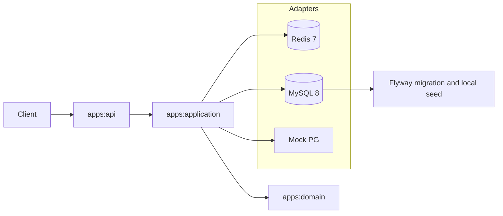
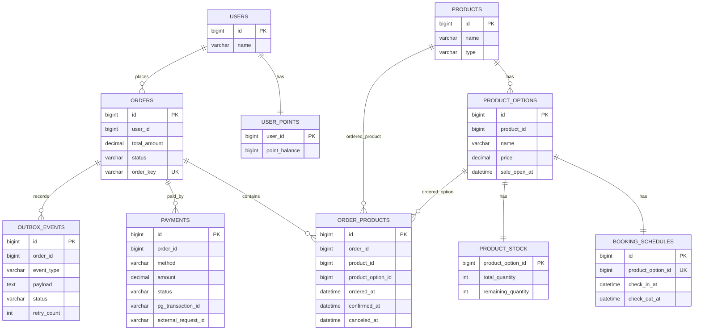
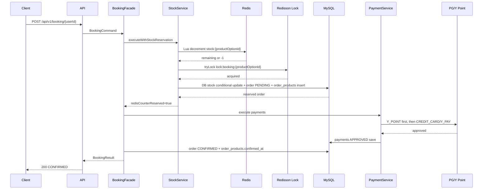

# Architecture Design

> 한정 수량 숙소 상품을 대상으로 하는 선착순 예약·결제 시스템의 현재 구현 기준 설계 문서다.
> 평시 50 TPS, 오픈 직후 1~5분간 500~1000 TPS 피크를 가정한다.

---

## 1. 요구사항과 현재 구현 범위

| 구분 | 현재 구현 |
|---|---|
| Checkout API | 상품 옵션, 예약 일정, 잔여 재고, 사용자 가용 포인트 조회 |
| Booking API | 판매 오픈 검증, 재고 예약, 결제 실행, 주문 확정 |
| Point Charge API | 사용자 포인트 충전 |
| 결제 수단 | `CREDIT_CARD`, `Y_PAY`, `Y_POINT` |
| 복합 결제 | `CREDIT_CARD + Y_POINT`, `Y_PAY + Y_POINT` 허용 |
| 멱등성 | `Idempotency-Key`를 `orders.order_key`로 저장하고 unique 제약으로 중복 방지 |
| Redis 장애 | Redis counter/lock 장애 시 DB-only fallback |
| 부하 검증 | k6 시나리오와 DB/Redis 정합성 검증 스크립트 제공 |

현재 구현은 "Redis가 정상일 때 빠른 매진 거절과 공정성을 얻고, Redis가 장애일 때도 DB 정합성은 유지한다"는 방향이다.

---

## 2. 모듈 구조

```text
fcfs-reservation
├── apps
│   ├── api
│   ├── application
│   └── domain
├── storage
│   ├── rdb
│   └── redis
├── external
│   └── pg
├── docker
└── k6
```

| 모듈 | 책임 |
|---|---|
| `apps:api` | Controller, request/response DTO, exception handling, API 기동 시 Redis 재고 counter 초기화 |
| `apps:application` | 예약 유스케이스 조율, 결제 전략 실행, 재고 gate, 트랜잭션 경계 |
| `apps:domain` | 도메인 모델, repository/gateway interface, 공통 error/lock/redis abstraction |
| `storage:rdb` | JPA entity/repository, Flyway migration, local seed data |
| `storage:redis` | Redis Lua counter, Redisson lock, Redis circuit breaker 예외 변환 |
| `external:pg` | 신용카드/Y 페이 mock PG gateway |

의존 방향은 `api -> application -> domain`이며, `storage:*`와 `external:pg`는 domain/application의 port를 구현한다.

---

## 3. 시스템 아키텍처



### 핵심 컴포넌트

| 컴포넌트 | 역할 |
|---|---|
| `BookingController` | `Idempotency-Key` UUID 형식 검증 후 `BookingCommand` 생성 |
| `BookingFacade` | 판매 오픈 검증, Redis/DB 재고 예약, 결제 실행, 주문 확정/실패 보상 조율 |
| `StockService` | Redis Lua counter + Redisson lock + DB-only fallback 흐름 제공 |
| `BookingReservationProcessor` | DB 재고 차감, PENDING 주문 생성, CONFIRMED/FAILED 상태 변경을 `REQUIRES_NEW`로 처리 |
| `PaymentService` | 결제 조합 검증, `Y_POINT` 우선 실행, 실패 시 성공 결제 역순 보상 |
| `StockCounterInitializer` | API 기동 시 DB 재고 기준으로 Redis `stock:{productOptionId}` 초기화 |

---

## 4. 도메인 모델

| Entity | 역할 |
|---|---|
| `Product` | 상품 메타. 현재 로컬 시드는 모두 `BOOKING` 타입 |
| `ProductOption` | 상품별 판매 옵션, 가격, 판매 오픈 시각 |
| `BookingSchedule` | 예약 옵션의 입실/퇴실 시각 |
| `ProductStock` | 상품 옵션 단위 총 재고와 잔여 재고 |
| `User` | 사용자 |
| `UserPoint` | 사용자 포인트 잔액 |
| `Order` | 주문. `PENDING`, `CONFIRMED`, `FAILED`, `CANCELLED` 상태 사용 |
| `OrderProduct` | 주문과 상품/상품 옵션을 연결하고 확정/취소 시각 기록 |
| `Payment` | 주문별 결제 결과. 복합 결제를 위해 order 1:N payment |
| `OutboxEvent` | 보상 실패 등 사후 확인이 필요한 이벤트 기록 |

### ERD



---

## 5. 핵심 DDL

전체 DDL은 `storage/rdb/src/main/resources/db/migration`에 있다. 아래는 주문/결제/재고 정합성 검토에 필요한 핵심 스키마다.

```sql
CREATE TABLE orders
(
    id           BIGINT         NOT NULL AUTO_INCREMENT PRIMARY KEY,
    user_id      BIGINT         NOT NULL,
    total_amount DECIMAL(19, 2) NOT NULL,
    status       VARCHAR(20)    NOT NULL,
    order_key    VARCHAR(64)    NOT NULL,
    created_at   DATETIME(3)    NOT NULL,
    updated_at   DATETIME(3),
    deleted_at   DATETIME(3),
    CONSTRAINT uk_order_key UNIQUE (order_key),
    INDEX idx_user_created (user_id, created_at)
) ENGINE = InnoDB;

CREATE TABLE product_stock
(
    product_option_id  BIGINT      NOT NULL PRIMARY KEY,
    total_quantity     INT         NOT NULL,
    remaining_quantity INT         NOT NULL,
    updated_at         DATETIME(3) NOT NULL,
    CONSTRAINT chk_remaining_non_negative CHECK (remaining_quantity >= 0)
) ENGINE = InnoDB;

CREATE TABLE order_products
(
    id                BIGINT      NOT NULL AUTO_INCREMENT PRIMARY KEY,
    order_id          BIGINT      NOT NULL,
    product_id        BIGINT      NOT NULL,
    product_option_id BIGINT      NOT NULL,
    ordered_at        DATETIME(3) NOT NULL,
    confirmed_at      DATETIME(3),
    canceled_at       DATETIME(3),
    INDEX idx_order_products_order_id (order_id),
    INDEX idx_order_products_product_id (product_id),
    INDEX idx_order_products_product_option_id (product_option_id)
) ENGINE = InnoDB;

CREATE TABLE payments
(
    id                  BIGINT         NOT NULL AUTO_INCREMENT PRIMARY KEY,
    order_id            BIGINT         NOT NULL,
    method              VARCHAR(20)    NOT NULL,
    amount              DECIMAL(19, 2) NOT NULL,
    status              VARCHAR(20)    NOT NULL,
    pg_transaction_id   VARCHAR(100),
    external_request_id VARCHAR(100),
    created_at          DATETIME(3)    NOT NULL,
    updated_at          DATETIME(3),
    deleted_at          DATETIME(3),
    INDEX idx_order_id (order_id)
) ENGINE = InnoDB;
```

정합성 방어는 DB에 마지막으로 걸린다. `orders.order_key`는 중복 요청을 막고, `product_stock.remaining_quantity`의 CHECK 제약은 코드나 Redis 가정이 깨져도 음수 재고를 거부한다.

---

## 6. API 명세 요약

### 6.1 Checkout

```http
GET /api/v1/checkout/{userId}?productOptionId={productOptionId}
```

응답의 `remainingQuantity`는 조회 시점의 참고값이다. 실제 차감은 Booking API에서 수행한다.

### 6.2 Booking

```http
POST /api/v1/booking/{userId}
Idempotency-Key: {uuid}
Content-Type: application/json
```

```json
{
  "productOptionId": 1,
  "totalAmount": 100000.00,
  "payments": [
    {
      "method": "Y_POINT",
      "amount": 30000.00
    },
    {
      "method": "CREDIT_CARD",
      "amount": 70000.00,
      "attributes": {
        "cardToken": "card-token"
      }
    }
  ]
}
```

`CREDIT_CARD`는 `cardToken`, `Y_PAY`는 `payToken`이 필요하다. `Y_POINT`는 path variable의 `userId`를 서버가 `PaymentCommand.userId`로 주입하므로 요청 body에 user id를 넣지 않는다.

### 6.3 Point Charge

```http
POST /api/v1/users/{userId}/points/charge
Content-Type: application/json
```

```json
{
  "amount": 50000
}
```

---

## 7. 정상 예약 시퀀스



분산락은 DB 재고 차감과 PENDING 주문 생성 구간만 보호한다. 결제는 락 밖에서 실행해 상품 옵션 단위 직렬화 시간을 줄인다.

---

## 8. 로컬 실행과 초기 데이터

Docker Compose의 API 컨테이너는 `SPRING_PROFILES_ACTIVE=prod,local-seed`로 실행된다.

`local-seed` profile은 `storage/rdb/src/main/resources/db/seed/local/R__local_seed_data.sql`을 Flyway repeatable migration으로 읽는다.

| 데이터 | 값 |
|---|---|
| 상품/옵션 | 1~10 |
| 옵션별 재고 | 10 |
| 사용자 | 1~1000 |
| 사용자별 포인트 | 1,000,000 |
| 판매 오픈 시각 | `2000-01-01 00:00:00.000` |

API 기동 후 `StockCounterInitializer`가 모든 DB 재고를 Redis `stock:{productOptionId}`로 초기화한다.

상세 실행 절차와 부하 검증은 [`05-runbook-and-validation.md`](./05-runbook-and-validation.md)를 따른다.
